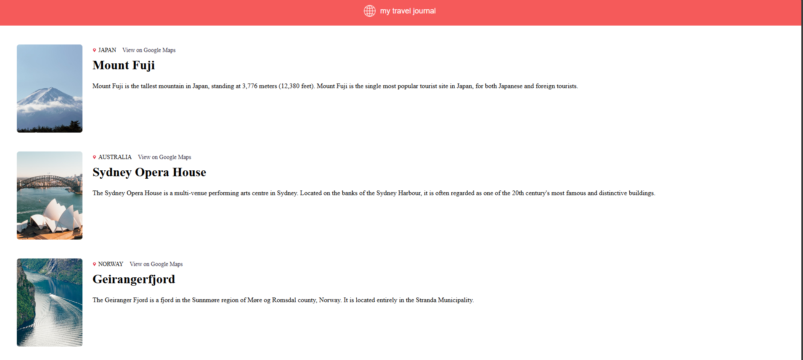

# 🌍 Travel Journal

<p align="center">
  
  
  
  
</p>

A sleek and responsive travel journal app built with **React + Vite**, showcasing curated travel destinations with images, descriptions, and Google Maps integration.

📁 **Repo:** [Travel_journal](https://github.com/Rohan-Adhav/Travel_journal.git)  
🌐 **Live Demo:** [Travel_journal](https://travel-journal-rohan.vercel.app/)  
🛠️ **Tech Stack:** React, Vite, JavaScript, CSS

---

## 🚀 Features

- 🗺️ Destination cards with images and descriptions  
- 📍 Google Maps links for each location  
- 🎨 Responsive layout and clean design  
- ⚡ Fast performance with Vite  
- 🧰 Modular component structure

---

## 📸 Preview

<p align="center">
  
</p>


---

## 📦 Installation

```bash
git clone https://github.com/Rohan-Adhav/Travel_journal.git
cd Travel_journal
npm install
npm run dev
